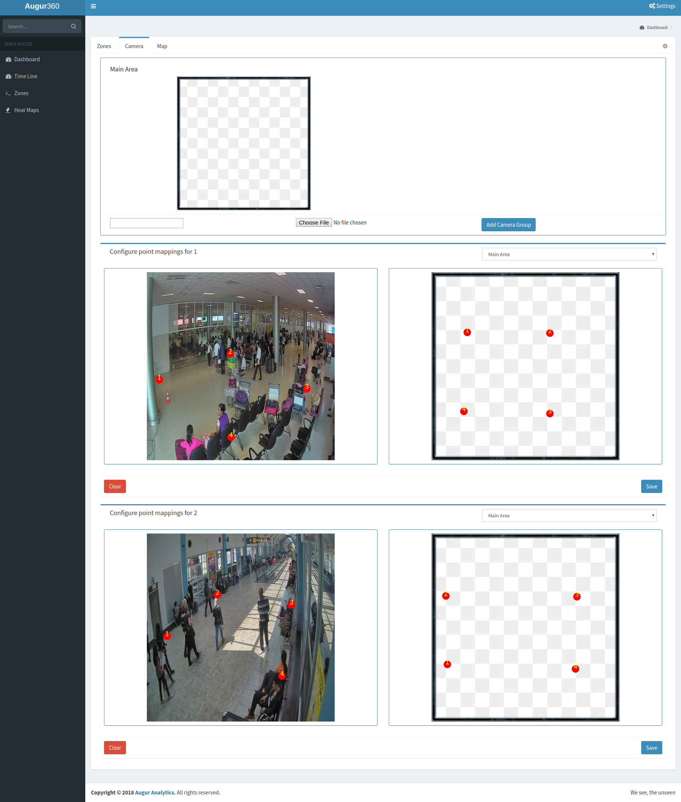
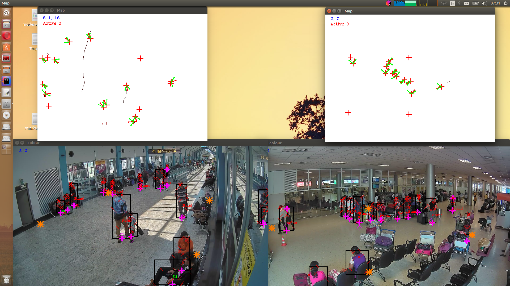
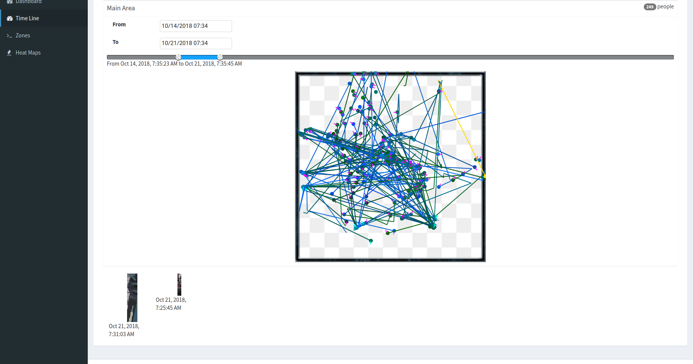

# Camera based Real-time Analytics on Movements of People (CRAMP)

We are developing a system for generating realtime analytics on movements of people in a multiple camera monitored environment.
* Ground Mapped Human Movement Analytics.
* Aggregrated Analytical Maps.
  - Human Density Maps
  - Head Direction Maps
  - Speed Bound Maps
* Per Person Level Analytics using Short Term Re-Identification and Tracking.

_CRAMP_SENSE_ is the Camera Module of system which is responsible for
* Detecting New Persons
* Mapping of detected persons to world space. (Ground Place Mapping)
* Tracking of Persons (for purpose of detecting new persons)
* Obtain snapshots (for re-id purpose) of newly detected persons.
* Communicating results to Analytics Core.

## Getting Started

This consists of 3 main components.

1. Sense (`/sense` directory) - Python components for processing video feeds.

2. Angular Web App (`/ngapp` directory) - An angular web application for viewing
analytics in real time.

3. Java Server (`dist` and `core` directories) - Includes the REST API and database 
connection logic.

### Running in development mode

1. First, run the **main** method of `CHASS` class. To run this, following system
properties need to be added to the *run configuration*. 
   * Use `-D` as shown when passing as VM options.
    ```
    -Ddb.jdbc.url="jdbc:mysql://localhost:3306/analytics?createDatabaseIfNotExist=true"
    -Ddb.user="root"
    -Ddb.password="root"
    -Dorg.augur.sense.mode="ACTIVE"
    -Dlog4j.configurationFile=log4j2-dev.xml 
    ```
    * Visit `http://localhost:8000` for the dashboard

### Configuration

Go to `Settings -> Camera` and *Add Camera Groups*. Then when you run the 
python clients, they will automatically send their camera views for 
point mapping configuration. You can configure the mapping as shown below.



### Examples

#### Real-time Processing
Python client processing two CCTV videos (of Bandaranayake International Airport, Sri Lanka)
in parallel. All the detected people are mapped to the ground map and tracked. We
are capable of tracing across cameras as well.



### Viewing Tracked Person Timelines

Under *Time Line* tab, the paths followed by each individual is shown. You
can click on each path to see pictures of the person corresponding to the 
selected path.

(Note: this example timeline looks confusing because of the crowded test videos used)


## Contributors

* Madhawa Vidanapathirana - madhawa.13@cse.mrt.ac.lk
* Imesha Sudasingha - imesha.13@cse.mrt.ac.lk
* Pasindu Kanchana - pasindukanchana.13@cse.mrt.ac.lk 
* Jayan Vidanapathirana - jayancv.13@cse.mrt.ac.lk
